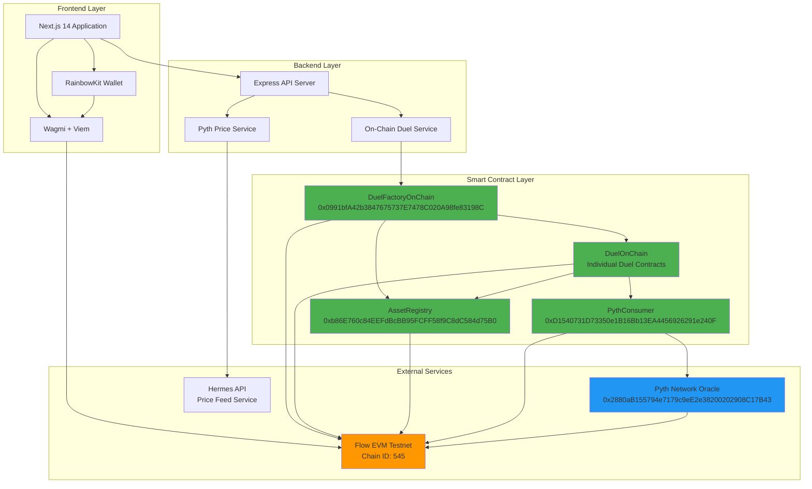
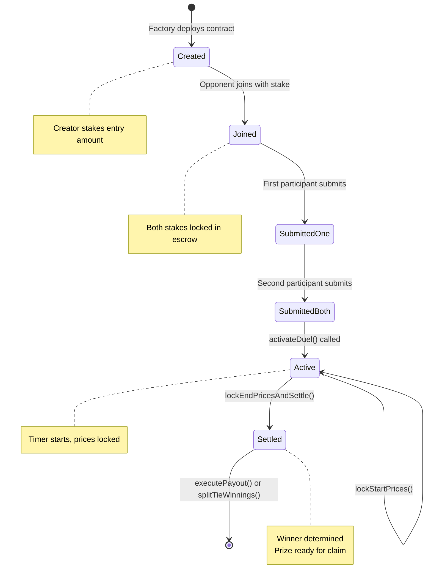
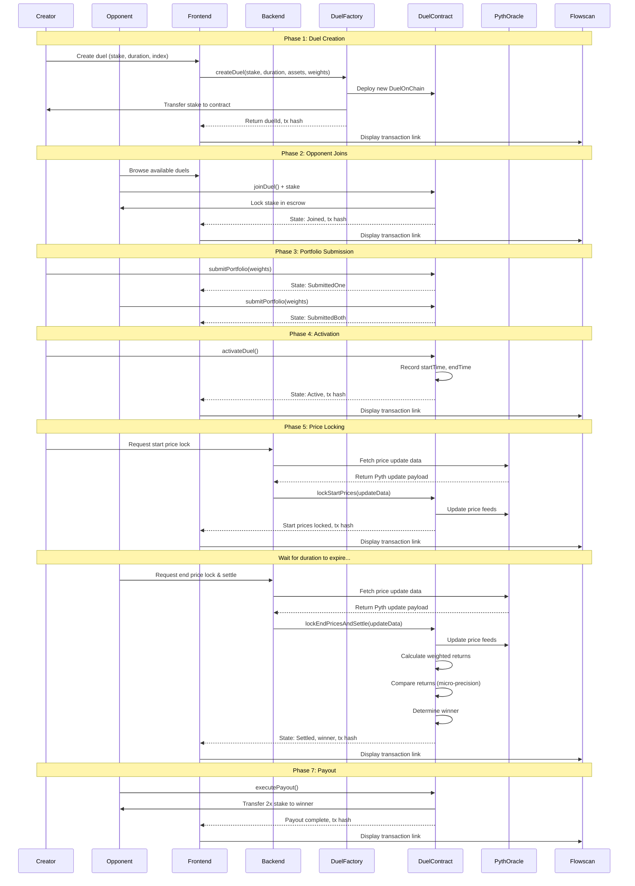

# FlowIn-Dex - Binary Options Trading Through Custom Index Duels

**Binary Options Trading Through Custom Index Duels**

FlowIn-Dex is a decentralized binary options platform where traders compete by creating custom weighted asset indexes. Instead of buying traditional call/put options, users stake an amount betting that their custom index will outperform their opponent's index over a fixed time period. The current implementation uses Flow EVM with Pyth Network oracles for transparent on-chain settlement.

**Note on Zama fhEVM**: A privacy-preserving encrypted track using Zama's fhEVM technology was planned but is not yet implemented. The current version operates with transparent on-chain settlement on Flow EVM.


---

## Features

### Binary Options Trading Model
- **Custom Index Creation**: Build your own weighted asset index instead of buying traditional options
- **Peer-to-Peer Betting**: Stake an amount betting your index will outperform your opponent's
- **Fixed Time Windows**: Duels run for predetermined periods (60 seconds to 30 days)
- **Winner Takes All**: Binary outcome - best performing index wins the entire prize pool
- **No Premium Decay**: Unlike traditional options, no time decay or premium costs

### Core Functionality
- **1v1 Index Duels**: Head-to-head custom index performance competitions
- **Tiered Assets**: 50/50 split requirement between Tier 1 (blue-chips) and Tier 2 (altcoins/stablecoins)
- **Real-time Prices**: Pyth Network oracle integration for accurate asset pricing
- **Transparent Settlement**: Winner determined by on-chain portfolio performance calculation
- **Escrow System**: Entry stakes locked in smart contracts, winner takes all
- **Transaction Verification**: Flowscan explorer links for all major on-chain events

### Asset Tiers
- **Tier 1 (Blue-Chip)**: BTC, ETH, SOL, BNB, LINK
- **Tier 2 (Altcoins/Stables)**: STRK, ARB, OP, MATIC, AVAX, USDC, USDT, DAI

### Precision Settlement
- Micro-basis-point precision (×1,000,000) prevents false ties
- Accurate winner determination even with small performance differences
- Transparent on-chain calculation with verifiable results

---

## Architecture

FlowIn-Dex uses a dual-track architecture:

1. **Transparent Track (Current Implementation)**: Flow EVM + Pyth oracles for public on-chain duels
2. **Encrypted Track (Planned)**: Zama fhEVM for privacy-preserving index competitions (not yet implemented)

### System Architecture Diagram



### Current System Architecture

```
┌─────────────────────────────────────────────────────────────┐
│                    Frontend (Next.js 14)                     │
│         RainbowKit + Wagmi + Viem + React 19                │
│              Portfolio Builder + Duel Management             │
└─────────────────────┬───────────────────────────────────────┘
                      │
                      ▼
┌─────────────────────────────────────────────────────────────┐
│                Backend API (Express + TypeScript)            │
│  ┌──────────────┐  ┌─────────────┐  ┌──────────────────┐   │
│  │ On-Chain     │  │ Pyth Oracle │  │  REST API        │   │
│  │ Duel Service │  │  Service    │  │  Endpoints       │   │
│  └──────────────┘  └─────────────┘  └──────────────────┘   │
└─────────────────────┬───────────────────────────────────────┘
                      │
                      ▼
┌─────────────────────────────────────────────────────────────┐
│              Smart Contracts (Solidity 0.8.24)               │
│  ┌──────────────┐  ┌─────────────┐  ┌──────────────────┐   │
│  │DuelFactory   │  │ DuelOnChain │  │ AssetRegistry    │   │
│  │OnChain       │  │             │  │                  │   │
│  └──────────────┘  └─────────────┘  └──────────────────┘   │
│  ┌──────────────────────────────────────────────────────┐   │
│  │           PythConsumer (Oracle Integration)          │   │
│  └──────────────────────────────────────────────────────┘   │
└─────────────────────┬───────────────────────────────────────┘
                      │
                      ▼
┌─────────────────────────────────────────────────────────────┐
│         Flow EVM Testnet  +  Pyth Network                   │
│         Chain ID: 545     +  Price Feeds                    │
└─────────────────────────────────────────────────────────────┘
```

---

## Tech Stack

### Smart Contracts
- **Solidity**: 0.8.24
- **Hardhat**: Development environment and testing
- **OpenZeppelin**: Standard contract utilities (Ownable)
- **Pyth SDK**: Oracle integration for price feeds
- **ethers.js**: Contract interaction library

### Backend
- **Node.js**: 20.x with TypeScript
- **Express**: RESTful API framework
- **ethers.js**: Blockchain interaction
- **Pyth Network**: Decentralized oracle (Hermes API)
- **Node-Cache**: In-memory price caching

### Frontend
- **Next.js**: 14.2.25 (React 19)
- **RainbowKit**: 2.2.10 (Wallet connection)
- **Wagmi**: 2.19.5 (React hooks for Ethereum)
- **Viem**: 2.47.6 (TypeScript Ethereum library)
- **Tailwind CSS**: 4.1.9 (Styling)
- **Radix UI**: Component primitives
- **Lucide React**: Icon library

### Infrastructure
- **Flow EVM Testnet**: Layer 1 blockchain (Chain ID: 545)
- **Pyth Network**: Decentralized oracle network
- **Flowscan**: Block explorer for transaction verification

---

## Getting Started

### Prerequisites

- Node.js 18+ and npm
- Git
- MetaMask or compatible EVM wallet

### Installation

1. **Clone the repository**
```bash
git clone https://github.com/yourusername/FlowIn-Dex.git
cd FlowIn-Dex
```

2. **Install contract dependencies**
```bash
cd contracts
npm install
```

3. **Install backend dependencies**
```bash
cd ../backend
npm install
```

4. **Install frontend dependencies**
```bash
cd ../frontend
npm install
```

### Configuration

#### Contracts Environment
```bash
cd contracts
cp .env.example .env
```

Edit `contracts/.env`:
```env
FLOW_EVM_RPC_URL=https://testnet.evm.nodes.onflow.org
FLOW_EVM_PRIVATE_KEY=your_private_key_here
FLOW_EVM_PYTH_ADDRESS=0x2880aB155794e7179c9eE2e38200202908C17B43
```

**Note**: The Pyth address above is the official Pyth Oracle on Flow EVM Testnet.

#### Backend Environment
```bash
cd backend
cp .env.example .env
```

Edit `backend/.env`:
```env
PORT=3000
NODE_ENV=development
FLOW_EVM_RPC_URL=https://testnet.evm.nodes.onflow.org
FLOW_EVM_PRIVATE_KEY=your_private_key_here
FLOW_EVM_DUEL_FACTORY=0x7304CbEF75964A5fC29667e588980d7C46e84C2d
PYTH_PRICE_SERVICE_URL=https://hermes.pyth.network
```

**Note**: The `FLOW_EVM_DUEL_FACTORY` address above is the currently deployed factory with payout fixes (April 1, 2026). You can use this address to interact with existing duels, or deploy your own instance.

#### Frontend Environment
```bash
cd frontend
cp .env.example .env.local
```

Edit `frontend/.env.local`:
```env
NEXT_PUBLIC_FLOW_EVM_RPC_URL=https://testnet.evm.nodes.onflow.org
NEXT_PUBLIC_DUEL_FACTORY=0x7304CbEF75964A5fC29667e588980d7C46e84C2d
NEXT_PUBLIC_CHAIN_ID=545
```

**Note**: The `NEXT_PUBLIC_DUEL_FACTORY` address above is the currently deployed factory with payout fixes (April 1, 2026). You can use this address to interact with existing duels, or deploy your own instance.

### Get Testnet Tokens

Visit the Flow Testnet Faucet:
```
https://testnet-faucet.onflow.org/
```

Enter your wallet address and request FLOW tokens for testing.

---

## Smart Contracts

### Deployed Contract Addresses

All contracts are deployed on **Flow EVM Testnet (Chain ID: 545)**:

| Contract | Address |
|----------|---------|
| **DuelFactoryOnChain** | `0x7304CbEF75964A5fC29667e588980d7C46e84C2d` |
| **AssetRegistry** | `0x4Ae45bc760A2b2f838fFba4b950A6950b290587E` |
| **PythConsumer** | `0x6A9B04365c328f5b77D49cE4BE71fd23FFEd19d3` |
| **Pyth Oracle** | `0x2880aB155794e7179c9eE2e38200202908C17B43` |

### Contract Overview

#### **DuelFactoryOnChain.sol**
Factory contract for creating and managing duels.

**Deployed Address**: `0x0991bfA42b3847675737E7478C020A98fe83198C`

**Key Functions:**
- `createDuel()`: Deploy a new duel with entry amount, duration, and asset configuration
- `getDuelDetails()`: Query duel contract address by ID
- `getAllDuelsPaginated()`: Get all duels with pagination
- `getDuelsPaginated()`: Get user's duels with pagination

**Configuration:**
- Minimum entry amount: 0.001 FLOW
- Minimum duration: 60 seconds
- Maximum duration: 30 days
- Platform fee: 0% (initially)

#### **DuelOnChain.sol**
Individual duel contract with portfolio logic and settlement.

**Deployed**: Individual instances created by factory for each duel

**Key Functions:**
- `joinDuel()`: Opponent joins with matching entry amount
- `submitPortfolio()`: Submit portfolio weights (must sum to 100%, 50% Tier 1, 50% Tier 2)
- `activateDuel()`: Start the duel timer
- `lockStartPrices()`: Lock starting prices from Pyth oracle
- `lockEndPricesAndSettle()`: Lock ending prices and compute winner
- `executePayout()`: Transfer prize pool to winner
- `splitTieWinnings()`: Split prize pool in case of exact tie

**State Machine:**


**Precision Settlement:**
- Calculates returns in micro-basis-points (×1,000,000 precision)
- Prevents false ties from rounding errors
- Stores precise returns on-chain for verification

#### **PythConsumer.sol**
Oracle integration for price feeds.

**Deployed Address**: `0xD1540731D73350e1B16Bb13EA4456926291e240F`

**Key Functions:**
- `updatePriceFeeds()`: Update multiple price feeds with Pyth data
- `getPrice()`: Get latest price for an asset
- `getPriceNoOlderThan()`: Get price with freshness check

#### **AssetRegistry.sol**
Manages asset metadata and tier classifications.

**Deployed Address**: `0xb86E760c84EEFdBcBB95FCFF58f9C8dC584d75B0`

**Key Functions:**
- `registerAssets()`: Register assets with price IDs, tiers, and symbols
- `getAssetInfo()`: Query asset metadata
- `getTierCounts()`: Get tier distribution for validation

---

## Backend API

### Starting the Backend

```bash
cd backend

# Development mode with hot reload
npm run dev

# Production build
npm run build
npm start
```

### Services

#### **PythPriceService**
- Fetches real-time prices from Pyth Hermes API
- Caches prices for performance
- Supports 13 assets across Tier 1 and Tier 2
- Provides price feed IDs for on-chain updates

#### **OnChainDuelService**
- Interacts with deployed smart contracts
- Handles duel creation, joining, portfolio submission
- Manages settlement and payout operations
- Provides duel state queries

---

## Frontend Application

### Key Pages

#### **Home Page** (`/`)
- Landing page with duel overview
- Connect wallet functionality
- Navigation to create/join duels

#### **Create Duel** (`/create-duel`)
- Visual portfolio builder with drag-and-drop
- Asset selection with tier badges (T1/T2)
- Real-time tier balance validation
- Entry amount and duration configuration
- Flowscan transaction link after creation

#### **Join Duel** (`/join-duel`)
- Browse available duels
- Portfolio builder with tier validation
- Asset selection with tier badges
- Join with matching entry amount
- Flowscan transaction link after joining

#### **Duel Detail** (`/duel/[id]`)
- Real-time duel state display
- Portfolio compositions for both participants
- Transaction history with Flowscan links
- Settlement results and winner announcement
- Action buttons for each duel stage

### Features

- **Wallet Integration**: RainbowKit with MetaMask, Rainbow, WalletConnect support
- **Responsive Design**: Mobile-friendly UI with Tailwind CSS
- **Real-time Updates**: Live duel state tracking
- **Transaction Tracking**: Flowscan explorer links for all major events
- **Tier Validation**: Visual feedback for 50/50 tier requirement

---

## How It Works

### Binary Options Trading Concept

FlowIn-Dex reimagines binary options trading through custom index competition:

**Traditional Binary Options:**
- Buy a call/put option on a single asset
- Pay a premium upfront
- Bet on price going up or down
- Fixed payout if correct, lose premium if wrong

**FlowIn-Dex Index Duels:**
- Create a custom weighted index of multiple assets
- Stake an amount (no premium, just your bet)
- Compete against another trader's index
- Winner takes the entire prize pool (2x stake)

**Key Advantages:**
- **Diversification**: Spread risk across multiple assets instead of betting on one
- **Strategy Expression**: Weight assets based on your market view
- **No Premium Cost**: Your stake is returned if you win (plus opponent's stake)
- **Peer-to-Peer**: Trade directly against another participant, not a market maker
- **Transparent Odds**: 50/50 competition, not house-edge pricing

### Example Scenario

**Traditional Options Trade:**
```
Buy BTC call option at $70,000 strike
Premium: $500
If BTC > $70,000 at expiry: Win $1,000 (net +$500)
If BTC < $70,000 at expiry: Lose $500
```

**FlowIn-Dex Index Duel:**
```
Create Index: 40% BTC, 30% ETH, 20% SOL, 10% LINK
Stake: $500
Opponent creates their index and stakes $500

After 24 hours:
Your index return: +3.5%
Opponent index return: +2.1%
Result: You win $1,000 (your $500 + opponent's $500)
```

### Duel Lifecycle

```
1. CREATE → 2. JOIN → 3. SUBMIT → 4. ACTIVATE → 5. LOCK → 6. SETTLE → 7. PAYOUT
   │          │         PORTFOLIOS    │           PRICES    │           │
Creator    Opponent    (both)       Start      Start/End   Winner    Prize
deploys     joins      submit       timer      prices      computed  released
contract              weights                  locked
```

### Duel Lifecycle Sequence Diagram



### Detailed Flow

#### 1. Duel Creation (Place Your Bet)
- Creator defines stake amount (min 0.001 FLOW), duration (60s - 30 days)
- Creates custom weighted index from available assets
- Assets are classified into Tier 1 (50%) and Tier 2 (50%)
- Stake locked in contract as escrow
- Duel ID generated and contract deployed
- Transaction hash displayed with Flowscan link

#### 2. Opponent Joins (Match the Bet)
- Opponent deposits matching stake amount
- Creates their own custom weighted index
- Both participants' stakes locked in escrow
- State transitions to `Joined`
- Transaction hash displayed with Flowscan link

#### 3. Portfolio Submission
- Each user submits portfolio weights (basis points, sum = 10000)
- Contract validates: total = 100%, Tier 1 = 50%, Tier 2 = 50%
- Weights stored on-chain
- State transitions through `SubmittedOne` → `SubmittedBoth`
- Transaction hash displayed with Flowscan link

#### 4. Duel Activation
- Either participant can activate after both submit
- Start timestamp recorded
- End timestamp calculated (start + duration)
- State transitions to `Active`
- Transaction hash displayed with Flowscan link

#### 5. Price Locking
- Start prices locked from Pyth oracle at activation
- After duration expires, end prices locked
- Pyth update data fetched from Hermes API
- On-chain price feeds updated
- Transaction hash displayed with Flowscan link

#### 6. Settlement (Determine Winner)
- Contract calculates weighted returns for both indexes
- Uses micro-basis-point precision (×1,000,000)
- Compares precise returns to determine winner (binary outcome)
- Best performing index wins
- Handles exact ties (rare with micro-precision)
- State transitions to `Settled`
- Transaction hash displayed with Flowscan link

#### 7. Payout (Winner Takes All)
- Winner receives total prize pool (2× stake amount)
- Or 50/50 split in case of exact tie
- Funds transferred from escrow to winner
- Duel finalized
- Transaction hash displayed with Flowscan link

**Payout Structure:**
- Winner: 2× stake (100% return on investment)
- Loser: 0 (loses entire stake)
- Tie: Each gets their stake back (0% return)

### Index Constraints

- **Total Weight**: Must equal 100% (10000 basis points)
- **Tier 1 Allocation**: Must equal 50% (5000 basis points)
- **Tier 2 Allocation**: Must equal 50% (5000 basis points)
- **Minimum Assets**: At least 2 assets required
- **Weight Range**: Each asset 0-100%

### Example Index

```
Tier 1 (50%):
- BTC: 30%
- ETH: 20%

Tier 2 (50%):
- STRK: 20%
- USDC: 30%

Total: 100% ✓
Tier 1: 50% ✓
Tier 2: 50% ✓
```

### Why This Is Better Than Traditional Options

| Feature | Traditional Options | FlowIn-Dex Index Duels |
|---------|-------------------|----------------------|
| **Upfront Cost** | Premium paid (lost if wrong) | Stake (returned if you win) |
| **Diversification** | Single asset exposure | Multi-asset custom index |
| **Time Decay** | Yes (theta decay) | No time decay |
| **Counterparty** | Market maker / exchange | Peer-to-peer trader |
| **Payout** | Fixed payout structure | Winner takes all (2x stake) |
| **Strategy** | Limited (call/put only) | Unlimited (custom weights) |
| **Transparency** | Opaque pricing models | Transparent on-chain settlement |

---

## Wallet Compatibility

### Recommended Wallets

| Wallet | Status | Notes |
|--------|--------|-------|
| **MetaMask** | Recommended | Best compatibility with Flow EVM |
| **Rainbow Wallet** | Supported | Works perfectly |
| **WalletConnect** | Supported | Good for mobile |
| **Coinbase Wallet** | Supported | Works well |
| **Flow Wallet** | Not Recommended | Has cross-VM compatibility issues |

### Flow Wallet Issue

Flow Wallet may experience issues with pure EVM dApps due to cross-VM (Cadence ↔ EVM) confusion. The wallet sometimes queries the Cadence Mainnet API instead of the EVM Testnet, causing transaction failures.

**Error Example:**
```
address 4791a4dbd575175e is invalid for chain flow-mainnet
hostname=https://rest-mainnet.onflow.org
```

**Solution:** Use MetaMask or another pure EVM wallet for the best experience.

### Adding Flow EVM Testnet to MetaMask

1. Open MetaMask
2. Click network dropdown → "Add Network" → "Add a network manually"
3. Enter these details:
   ```
   Network Name: Flow EVM Testnet
   RPC URL: https://testnet.evm.nodes.onflow.org
   Chain ID: 545
   Currency Symbol: FLOW
   Block Explorer: https://evm-testnet.flowscan.io
   ```
4. Click "Save"

---

## Development

### Compile Contracts

```bash
cd contracts
npm run compile
```

### Run Tests

```bash
cd contracts
npm run test
```

### Run On-Chain Duel Test

This script runs a complete duel lifecycle on Flow EVM Testnet:

```bash
cd contracts
npm run test-on-chain-duel
```

Expected output includes:
- Transaction hashes for all operations
- Block numbers and gas used
- Flowscan explorer links
- Start and end price snapshots
- Per-asset price changes
- Precise settlement values (micro-bps)
- Winner determination
- Payout confirmation

### Local Development

1. **Start backend**:
```bash
cd backend
npm run dev
```

Backend runs on `http://localhost:3000`

2. **Start frontend**:
```bash
cd frontend
npm run dev
```

Frontend runs on `http://localhost:3001`

3. **Connect wallet** to Flow EVM Testnet (Chain ID: 545)

4. **Get testnet tokens** from faucet

5. **Create and join duels** through the UI

---

## Deployment

### Using Deployed Contracts

The contracts are already deployed on Flow EVM Testnet. See the [Smart Contracts](#smart-contracts) section above for deployed addresses and Flowscan verification links.

You can use these deployed contracts immediately by configuring your `.env` files with the factory address: `0x0991bfA42b3847675737E7478C020A98fe83198C`

### Deploy Your Own Instance

If you want to deploy your own instance of the contracts:

#### Deploy Contracts to Flow EVM Testnet

1. **Configure environment**:
```bash
cd contracts
# Edit .env with your private key
```

2. **Deploy**:
```bash
npm run deploy-on-chain
```

3. **Copy deployed addresses**:
```bash
# Output will show:
# PythConsumer: 0x...
# AssetRegistry: 0x...
# DuelFactoryOnChain: 0x...
```

4. **Update backend `.env`**:
```bash
cd ../backend
# Add FLOW_EVM_DUEL_FACTORY=<factory_address>
```

5. **Update frontend `.env.local`**:
```bash
cd ../frontend
# Add NEXT_PUBLIC_DUEL_FACTORY=<factory_address>
```

### Deploy Backend

```bash
cd backend
npm run build
npm start
```

### Deploy Frontend

```bash
cd frontend
npm run build
npm start
```

---

## API Documentation

### Base URL
```
http://localhost:3000/api
```

### Health Check

```http
GET /health

Response:
{
  "status": "healthy",
  "timestamp": "2026-04-01T12:00:00.000Z",
  "service": "FlowIn-Dex API",
  "version": "1.0.0"
}
```

### Price Endpoints

#### Get Supported Assets
```http
GET /api/prices/supported

Response:
{
  "success": true,
  "symbols": ["BTC", "ETH", "SOL", "BNB", "LINK", "STRK", "ARB", "OP", "MATIC", "AVAX", "USDC", "USDT", "DAI"],
  "count": 13
}
```

#### Get Asset Price
```http
GET /api/prices/:symbol

Example: GET /api/prices/BTC

Response:
{
  "success": true,
  "price": {
    "symbol": "BTC",
    "price": 67234.55,
    "publishTime": 1234567890,
    "expo": -8
  }
}
```

#### Get Batch Prices
```http
POST /api/prices/batch
Content-Type: application/json

Body:
{
  "symbols": ["BTC", "ETH", "SOL"]
}

Response:
{
  "success": true,
  "prices": {
    "BTC": { "price": 67234.55, "publishTime": 1234567890 },
    "ETH": { "price": 3456.78, "publishTime": 1234567890 },
    "SOL": { "price": 123.45, "publishTime": 1234567890 }
  }
}
```

### Duel Endpoints

#### Get Duel Details
```http
GET /api/duels/:duelId

Response:
{
  "success": true,
  "duel": {
    "duelId": "0x...",
    "state": "Active",
    "creator": "0x...",
    "opponent": "0x...",
    "entryAmount": "1000000000000000",
    "entryAmountFormatted": "0.001",
    "startTime": 1234567890,
    "endTime": 1234654290,
    "winner": null
  }
}
```

#### Check Settlement Status
```http
GET /api/duels/:duelId/can-settle

Response:
{
  "success": true,
  "canSettle": true,
  "duelId": "0x...",
  "state": "Active",
  "endTime": 1234654290
}
```

---

## Troubleshooting

### Common Issues

#### 1. Wallet Connection Fails

**Problem**: Cannot connect wallet to dApp

**Solutions**:
- Ensure you're using MetaMask or compatible EVM wallet
- Add Flow EVM Testnet network manually (see Wallet Compatibility section)
- Check that Chain ID is 545
- Try refreshing the page and reconnecting

#### 2. Transaction Fails with "Insufficient Funds"

**Problem**: Transaction reverts due to low balance

**Solutions**:
- Get testnet FLOW from faucet: https://testnet-faucet.onflow.org/
- Ensure you have enough for entry amount + gas fees
- Wait a few minutes for faucet transaction to confirm

#### 3. "Flow Wallet" Cross-VM Error

**Problem**: Error mentions "flow-mainnet" or Cadence addresses

**Solution**:
- Switch to MetaMask (recommended)
- See detailed fix in `FLOW_WALLET_ISSUE_FIX.md`

#### 4. Portfolio Validation Fails

**Problem**: Cannot submit portfolio, tier validation error

**Solutions**:
- Ensure total weight = 100%
- Ensure Tier 1 assets = 50%
- Ensure Tier 2 assets = 50%
- Check that all weights are non-negative

#### 5. Settlement Fails

**Problem**: Cannot settle duel after duration expires

**Solutions**:
- Ensure duel duration has fully elapsed
- Ensure start prices were locked
- Check that duel state is `Active`
- Verify Pyth oracle is accessible

#### 6. Next.js Cache Issues

**Problem**: Module resolution errors, webpack cache errors

**Solution**:
```bash
cd frontend
Remove-Item -Recurse -Force .next
npm run dev
```

See `CACHE_FIX_INSTRUCTIONS.md` for details.

---

## Roadmap

### Phase 1: Transparent On-Chain MVP (Current)
- [x] Binary options through custom index competition
- [x] Core duel contracts on Flow EVM
- [x] Tiered asset system (50/50 split)
- [x] Pyth oracle integration
- [x] Micro-precision settlement (prevents false ties)
- [x] Winner-takes-all payout mechanism
- [x] Backend API with REST endpoints
- [x] Frontend with RainbowKit wallet integration
- [x] Flowscan transaction verification links
- [x] Comprehensive testing and documentation

### Phase 2: Enhanced Features
- [ ] Multi-round tournaments (bracket-style competitions)
- [ ] Team duels (3v3, 5v5 index battles)
- [ ] Leaderboard system (track best performing indexes)
- [ ] Historical analytics dashboard (win rate, ROI tracking)
- [ ] Variable payout structures (not just winner-takes-all)
- [ ] Index templates (save and reuse successful strategies)
- [ ] Mobile-responsive improvements
- [ ] Social features (share duels, invite friends)

### Phase 3: Privacy Track (fhEVM)
- [ ] Encrypted index duels using Zama fhEVM (not yet implemented)
- [ ] Client-side encryption with fhEVM SDK
- [ ] Selective decryption (winner only)
- [ ] ACL-based access control
- [ ] Privacy-preserving leaderboards

**Note**: The encrypted privacy track using Zama's fhEVM technology is planned for future implementation. The current version uses transparent on-chain settlement on Flow EVM.

### Phase 4: Cross-Chain Expansion
- [ ] Deploy to additional EVM chains
- [ ] Cross-chain duel support
- [ ] Multi-chain asset support
- [ ] Unified liquidity pools

---

## Contributing

We welcome contributions! Please follow these steps:

1. Fork the repository
2. Create a feature branch (`git checkout -b feature/amazing-feature`)
3. Commit your changes (`git commit -m 'Add amazing feature'`)
4. Push to the branch (`git push origin feature/amazing-feature`)
5. Open a Pull Request

---

## License

This project is licensed under the MIT License - see the [LICENSE](LICENSE) file for details.

---

## Acknowledgments

- **Flow** - EVM-compatible blockchain infrastructure and testnet deployment
- **Pyth Network** - Decentralized oracle for real-time price feeds
- **OpenZeppelin** - Secure contract libraries
- **RainbowKit** - Beautiful wallet connection UX
- **Zama** - Inspiration for future fhEVM privacy integration (not yet implemented)

---

## Contact & Support

- **GitHub Issues**: [Report bugs or request features](https://github.com/yourusername/FlowIn-Dex/issues)
- **Documentation**: See project documentation files for detailed guides
- **Block Explorer**: [Flowscan Testnet](https://evm-testnet.flowscan.io)

---

Built for transparent and fair DeFi competition

**FlowIn-Dex** - Binary options trading reimagined through custom index competition
